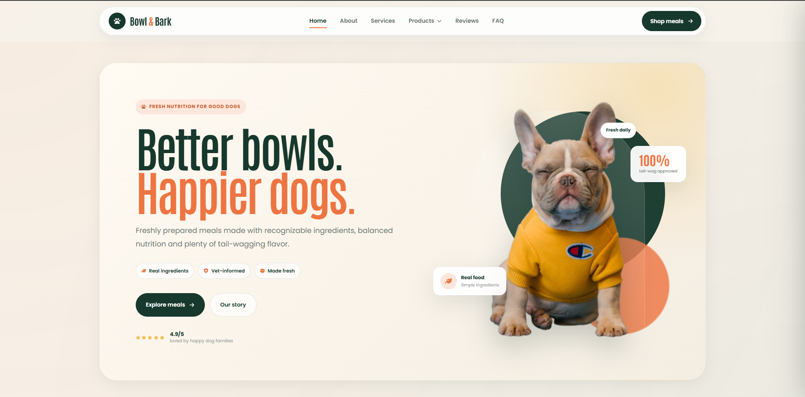

# Bowl & Bark - Dog Food Website

A modern and responsive dog food website frontend built with React.

The project focuses on a clean premium design, smooth user interactions, responsive layouts, reusable components, lazy-loaded routes, subtle animations, and an organized React architecture.

---

## Preview

Bowl & Bark is designed as a modern dog food brand website featuring product discovery, services, customer reviews, FAQs, product details, and account UI.

The application is frontend-only and does not currently include a backend, authentication service, payment gateway, or real ordering system.

---

## Features

- Modern responsive user interface
- Desktop, tablet, and mobile layouts
- Mobile slide-out navigation menu
- Sticky navigation header
- Interactive product dropdown
- Smooth hover effects
- Subtle micro animations
- Reusable React components
- React Router navigation
- BrowserRouter implementation
- Lazy-loaded pages
- React Suspense route loader
- Route-based Suspense key
- Smooth scroll-to-top behavior
- Floating Go to Top button
- Product listing page
- Reusable product details page
- Services page
- Customer reviews page
- Interactive FAQ accordion
- Login interface
- Custom 404 page
- Responsive footer
- React Icons
- SCSS Modules
- Accessible buttons and navigation elements
- Reduced-motion support
- Clean component-based architecture

---

## Tech Stack

- React
- React DOM
- React Router DOM
- React Icons
- JavaScript
- SCSS
- CSS Modules
- Create React App

---

## Project Structure

    src
    │
    ├── components
    │   ├── Header
    │   │   ├── index.jsx
    │   │   └── styled.module.scss
    │   │
    │   ├── Footer
    │   │   ├── index.jsx
    │   │   └── styled.module.scss
    │   │
    │   ├── ScrollToTop
    │   │   ├── index.jsx
    │   │   └── styled.module.scss
    │   │
    │   ├── PageLoader
    │   │   ├── index.jsx
    │   │   └── styled.module.scss
    │   │
    │   ├── SectionHeader
    │   │   ├── index.jsx
    │   │   └── styled.module.scss
    │   │
    │   ├── ProductCard
    │   │   ├── index.jsx
    │   │   └── styled.module.scss
    │   │
    │   ├── ReviewCard
    │   │   ├── index.jsx
    │   │   └── styled.module.scss
    │   │
    │   ├── ServiceCard
    │   │   ├── index.jsx
    │   │   └── styled.module.scss
    │   │
    │   ├── TopSection
    │   │   ├── images
    │   │   ├── index.jsx
    │   │   └── styled.module.scss
    │   │
    │   ├── BuyProduct
    │   │   ├── images
    │   │   ├── index.jsx
    │   │   └── styled.module.scss
    │   │
    │   ├── CustomerReviews
    │   │   ├── images
    │   │   ├── index.jsx
    │   │   └── styled.module.scss
    │   │
    │   ├── OurBestSellingProducts
    │   │   ├── images
    │   │   ├── index.jsx
    │   │   └── styled.module.scss
    │   │
    │   ├── OurServicesForYou
    │   │   ├── images
    │   │   ├── index.jsx
    │   │   └── styled.module.scss
    │   │
    │   ├── VetsSuggestions
    │   │   ├── images
    │   │   ├── index.jsx
    │   │   └── styled.module.scss
    │   │
    │   └── YourRecipes
    │       ├── images
    │       ├── index.jsx
    │       └── styled.module.scss
    │
    ├── pages
    │   ├── home
    │   │   ├── index.jsx
    │   │   └── styled.module.scss
    │   │
    │   ├── about
    │   │   ├── images
    │   │   ├── index.jsx
    │   │   └── styled.module.scss
    │   │
    │   ├── Products
    │   │   ├── index.jsx
    │   │   └── styled.module.scss
    │   │
    │   ├── ProductDetails
    │   │   ├── index.jsx
    │   │   └── styled.module.scss
    │   │
    │   ├── services
    │   │   ├── images
    │   │   ├── index.jsx
    │   │   └── styled.module.scss
    │   │
    │   ├── Reviews
    │   │   ├── index.jsx
    │   │   └── styled.module.scss
    │   │
    │   ├── Faq
    │   │   ├── index.jsx
    │   │   └── styled.module.scss
    │   │
    │   ├── Login
    │   │   ├── index.jsx
    │   │   └── styled.module.scss
    │   │
    │   └── NotFound
    │       ├── index.jsx
    │       └── styled.module.scss
    │
    ├── routes
    │   └── AppRoutes.jsx
    │
    ├── App.js
    ├── index.js
    └── index.css

---

## Pages

### Home

The homepage combines several reusable sections:

- Hero section
- Services
- Best-selling products
- Recipe information
- Veterinary suggestions
- Customer reviews
- Product call-to-action

### About

Introduces the Bowl & Bark brand, its approach to dog food, core values, and product philosophy.

### Products

Displays the available meal options using reusable product cards.

### Product Details

A reusable dynamic route handles individual products using a route parameter.

Example routes:

- `/product/product1`
- `/product/product2`
- `/product/product3`

### Services

Explains meal planning, delivery, packaging, and the overall customer experience.

### Reviews

Displays customer experiences and ratings using reusable review components.

### FAQ

Includes an interactive accordion for common questions about products, feeding, delivery, and the website.

### Login

A responsive frontend login interface with:

- Email field
- Password field
- Show and hide password control
- Remember me option
- Forgot password button

Authentication is not connected.

### Not Found

A custom responsive 404 page for unknown routes.

---

## Routing

Routing is handled using React Router DOM.

Pages are loaded using `React.lazy()`.

The route layer uses `Suspense` with the current pathname as its key so route transitions receive a fresh Suspense boundary.

Example:

    <Suspense
        key={location.pathname}
        fallback={<PageLoader />}
    >
        <Routes location={location}>
            ...
        </Routes>
    </Suspense>

---

## Available Routes

| Route                 | Page            |
| --------------------- | --------------- |
| `/`                   | Home            |
| `/about`              | About           |
| `/product`            | Products        |
| `/product/:productId` | Product Details |
| `/services`           | Services        |
| `/reviews`            | Reviews         |
| `/faq`                | FAQ             |
| `/login`              | Login           |
| `*`                   | Not Found       |

---

## Reusable Components

The application separates reusable UI from route-level pages.

Important reusable components include:

- `Header`
- `Footer`
- `ScrollToTop`
- `PageLoader`
- `SectionHeader`
- `ProductCard`
- `ReviewCard`
- `ServiceCard`
- `TopSection`
- `BuyProduct`
- `CustomerReviews`
- `OurBestSellingProducts`
- `OurServicesForYou`
- `VetsSuggestions`
- `YourRecipes`

---

## Styling

The project uses SCSS Modules for component and page-specific styles.

Example:

    Component
    ├── index.jsx
    └── styled.module.scss

Global design variables are defined in `src/index.css`.

The design system includes:

- Primary green colors
- Warm cream backgrounds
- Orange accent color
- Consistent border radii
- Reusable shadows
- Responsive page spacing
- Shared transitions
- Responsive typography

---

## Responsive Design

The website is optimized for:

- Desktop
- Laptop
- Tablet
- Mobile

The navigation automatically switches to a slide-out drawer on smaller screens.

The mobile menu includes:

- Solid background
- Dark page overlay
- Product submenu
- Animated open and close interaction
- Responsive navigation controls

---

## Animations and Interactions

The interface includes lightweight interactions such as:

- Card elevation on hover
- Image zoom effects
- Button movement
- Arrow animations
- Icon rotation
- Floating hero elements
- FAQ transitions
- Mobile drawer animations
- Product dropdown animation
- Smooth scrolling

Motion is automatically minimized when the operating system has reduced-motion enabled.

---

## Getting Started

Clone the repository:

    git clone https://github.com/a2rp/dog-food-website-frontend-design.git

Move into the project directory:

    cd dog-food-website-frontend-design

Install dependencies:

    npm install

Start the development server:

    npm start

The application will start in development mode.

---

## Build

Create a production build using:

    npm run build

The optimized production files will be generated inside the `build` directory.

---

## Frontend-Only Project

This project currently demonstrates the frontend experience only.

The following systems are not connected:

- Backend API
- Database
- Real authentication
- User accounts
- Payment gateway
- Shopping cart persistence
- Real checkout
- Order processing
- Delivery management

These features can be integrated separately if required.

---

## Design Goals

The project was modernized with the following goals:

1. Clean and premium visual design
2. Better reusable component architecture
3. Responsive mobile experience
4. Smooth and lightweight interactions
5. Clear separation between pages and components
6. Lazy-loaded route pages
7. Reduced duplicated code
8. Maintainable SCSS module structure
9. Improved accessibility
10. Consistent styling throughout the application

---

## Scripts

### Start Development Server

    npm start

### Create Production Build

    npm run build

### Run Tests

    npm test

---

## Browser Support

The application is intended for modern browsers including:

- Google Chrome
- Microsoft Edge
- Mozilla Firefox
- Safari

---

## License

This project is licensed under the MIT License.

See the `LICENSE` file for details.

---

## Author

**Ashish Ranjan**

- Portfolio: https://www.ashishranjan.net
- GitHub: https://github.com/a2rp
- LinkedIn: https://www.linkedin.com/in/aashishranjan

---

## Support

If you find this project useful and would like to support future development:

https://a2rp-donation-page.netlify.app/

---

Copyright © Ashish Ranjan. All rights reserved.

## Links

- Portfolio: [https://www.ashishranjan.net](https://www.ashishranjan.net)
- GitHub: [https://github.com/a2rp](https://github.com/a2rp)
- CodePen: [https://codepen.io/ash1198](https://codepen.io/ash1198)
- LinkedIn: [https://www.linkedin.com/in/aashishranjan](https://www.linkedin.com/in/aashishranjan)
- Facebook: [https://www.facebook.com/theash.ashish/](https://www.facebook.com/theash.ashish/)
- YouTube: [https://www.youtube.com/@ashishranjan-ashz?sub_confirmation=1](https://www.youtube.com/@ashishranjan-ashz?sub_confirmation=1)
- Email: [ash.ranjan09@gmail.com](mailto:ash.ranjan09@gmail.com)

## Support

- Support: [https://a2rp-donation-page.netlify.app/](https://a2rp-donation-page.netlify.app/)
- Buy Me A Coffee: [https://buymeacoffee.com/a2rp](https://buymeacoffee.com/a2rp)
- Patreon: [https://patreon.com/a2rp](https://patreon.com/a2rp)
<!-- Project links -->

## Links

- Live: [https://a2rp.github.io/dog-food-website-frontend-design/](https://a2rp.github.io/dog-food-website-frontend-design/)
- Repository: [https://github.com/a2rp/dog-food-website-frontend-design](https://github.com/a2rp/dog-food-website-frontend-design)
- Portfolio: [https://www.ashishranjan.net/](https://www.ashishranjan.net/)
- GitHub: [https://github.com/a2rp](https://github.com/a2rp)
- CodePen: [https://codepen.io/ash1198](https://codepen.io/ash1198)
- LinkedIn: [https://www.linkedin.com/in/aashishranjan](https://www.linkedin.com/in/aashishranjan)
- Facebook: [https://www.facebook.com/theash.ashish/](https://www.facebook.com/theash.ashish/)
- YouTube: [https://www.youtube.com/@ashishranjan-ashz?sub_confirmation=1](https://www.youtube.com/@ashishranjan-ashz?sub_confirmation=1)
- Email: [ash.ranjan09@gmail.com](mailto:ash.ranjan09@gmail.com)

## Support

- Support: [https://a2rp-donation-page.netlify.app/](https://a2rp-donation-page.netlify.app/)
- Buy Me a Coffee: [https://buymeacoffee.com/a2rp](https://buymeacoffee.com/a2rp)
- Patreon: [https://www.patreon.com/a2rp](https://www.patreon.com/a2rp)
